# CI/CD Documentation - EMF Safe Haven

## Table of Contents
1. [Overview](#overview)
2. [Changes Made](#changes-made)
3. [How It Works](#how-it-works)
4. [Workflow File Details](#workflow-file-details)
5. [Email Popup Feature](#email-popup-feature)
6. [Future Edits](#future-edits)
7. [Rollback Steps](#rollback-steps)
8. [Regenerating Netlify Token](#regenerating-netlify-token)
9. [Troubleshooting](#troubleshooting)
10. [Important Links](#important-links)

---

## Overview

This repository now has a fully automated **GitHub Actions CI/CD pipeline** that deploys the EMF Safe Haven website to **Netlify** automatically whenever changes are pushed to the `main` branch or when pull requests are created.

### What Was Set Up:
- ✅ **GitHub Actions workflow** for automated CI/CD
- ✅ **Netlify deployment integration** with production deployment
- ✅ **Automated build process** using Next.js
- ✅ **Email popup component** with 6-second delay for newsletter signups
- ✅ **Secure secret management** for deployment credentials

### Benefits:
- 🚀 **Instant deployments** - Code pushed to main is automatically deployed
- 🔒 **Secure** - Credentials stored as encrypted GitHub secrets
- ✅ **Automated testing** - Build process validates code before deployment
- 📊 **Deployment tracking** - View deployment status in GitHub Actions tab
- 🔄 **Preview deployments** - Pull requests get preview deployments

---

## Changes Made

### 1. GitHub Repository Secrets Added

Two critical secrets were configured in the repository settings:

| Secret Name | Purpose | Location |
|------------|---------|----------|
| `NETLIFY_AUTH_TOKEN` | Authentication token for Netlify CLI | Settings → Secrets → Actions |
| `NETLIFY_SITE_ID` | Unique identifier for the Netlify site | Settings → Secrets → Actions |

**How to view/edit secrets:**
1. Navigate to repository: https://github.com/ACIM2025/emf-safe-haven
2. Click **Settings** tab
3. Go to **Secrets and variables** → **Actions**
4. Secrets are encrypted and cannot be viewed, only updated or deleted

---

### 2. GitHub Actions Workflow Created

**File:** `.github/workflows/netlify-deploy.yml`  
**Commit:** `84e090d` - "Add GitHub Actions workflow for Netlify deployment"  
**Branch:** `main`

The workflow file configures automated deployment on push and pull request events.

---

### 3. Email Popup Component

**File:** `components/email-popup.tsx`  
**Commit:** `26510e0` - "Add email popup with 6-second delay"  
**Pull Request:** #4  
**Branch:** `email-popup-6sec-delay` → merged to `main`

Key features:
- ⏱️ **6-second delay** before showing popup
- 💾 **LocalStorage tracking** - Won't show again if closed or submitted
- 📧 **Newsletter integration** - Connects to `/api/newsletter` endpoint
- ✨ **Beautiful UI** - Gradient design with smooth animations
- ♿ **Accessible** - Proper ARIA labels and keyboard navigation

---

## How It Works

### CI/CD Pipeline Flow

```mermaid
graph LR
    A[Developer pushes code] --> B[GitHub detects push to main]
    B --> C[GitHub Actions triggers workflow]
    C --> D[Checkout code]
    D --> E[Setup Node.js 18]
    E --> F[Install dependencies]
    F --> G[Build Next.js project]
    G --> H[Install Netlify CLI]
    H --> I[Deploy to Netlify]
    I --> J[✅ Live on Netlify]
```



### Step-by-Step Process:

1. **Developer Action**: Code is pushed to `main` branch or PR is created
2. **GitHub Actions**: Workflow is triggered automatically
3. **Environment Setup**: Ubuntu runner with Node.js 18 is provisioned
4. **Dependency Installation**: `npm ci` installs exact versions from `package-lock.json`
5. **Build Process**: `npm run build` creates optimized production build
6. **Netlify CLI**: Installed globally for deployment
7. **Authentication**: Uses `NETLIFY_AUTH_TOKEN` from secrets
8. **Deployment**: Uploads `build` directory to Netlify site
9. **Success Report**: Confirmation message displayed in workflow logs

---

## Workflow File Details

### Complete Workflow Configuration

```yaml
name: Deploy to Netlify

on:
  push:
    branches:
      - main
  pull_request:
    branches:
      - main

jobs:
  deploy:
    runs-on: ubuntu-latest
    
    steps:
      - name: Checkout code
        uses: actions/checkout@v3
      
      - name: Setup Node.js
        uses: actions/setup-node@v3
        with:
          node-version: '18'
      
      - name: Install dependencies
        run: npm ci
      
      - name: Build project
        run: npm run build
      
      - name: Install Netlify CLI
        run: npm install -g netlify-cli
      
      - name: Deploy to Netlify
        env:
          NETLIFY_AUTH_TOKEN: ${{ secrets.NETLIFY_AUTH_TOKEN }}
          NETLIFY_SITE_ID: ${{ secrets.NETLIFY_SITE_ID }}
        run: |
          netlify deploy --prod --dir=build --auth=$NETLIFY_AUTH_TOKEN --site=$NETLIFY_SITE_ID
      
      - name: Report deployment status
        if: success()
        run: echo "✅ Deployment successful!"
```

### Explanation of Each Step:

#### 1. **Checkout code**
```yaml
- name: Checkout code
  uses: actions/checkout@v3
```
- **Purpose**: Downloads the repository code to the runner
- **Action**: Official GitHub action for repository checkout
- **Version**: v3 (stable release)

#### 2. **Setup Node.js**
```yaml
- name: Setup Node.js
  uses: actions/setup-node@v3
  with:
    node-version: '18'
```
- **Purpose**: Installs Node.js runtime environment
- **Version**: Node.js 18 (LTS version)
- **Why**: Next.js requires Node.js to build and run

#### 3. **Install dependencies**
```yaml
- name: Install dependencies
  run: npm ci
```
- **Purpose**: Installs all project dependencies
- **Command**: `npm ci` (clean install)
- **Why `ci` not `install`**: 
  - Faster installation
  - Uses exact versions from `package-lock.json`
  - Ideal for CI/CD environments
  - Removes `node_modules` before installing

#### 4. **Build project**
```yaml
- name: Build project
  run: npm run build
```
- **Purpose**: Creates optimized production build
- **Command**: Runs the `build` script from `package.json`
- **Output**: Generates static files in `build/` or `.next/` directory
- **What happens**:
  - TypeScript compilation
  - Code optimization and minification
  - Static page generation
  - Asset bundling

#### 5. **Install Netlify CLI**
```yaml
- name: Install Netlify CLI
  run: npm install -g netlify-cli
```
- **Purpose**: Installs Netlify command-line tool
- **Flag**: `-g` installs globally on the runner
- **Why needed**: Provides `netlify deploy` command

#### 6. **Deploy to Netlify**
```yaml
- name: Deploy to Netlify
  env:
    NETLIFY_AUTH_TOKEN: ${{ secrets.NETLIFY_AUTH_TOKEN }}
    NETLIFY_SITE_ID: ${{ secrets.NETLIFY_SITE_ID }}
  run: |
    netlify deploy --prod --dir=build --auth=$NETLIFY_AUTH_TOKEN --site=$NETLIFY_SITE_ID
```
- **Purpose**: Uploads built files to Netlify
- **Environment Variables**: 
  - `NETLIFY_AUTH_TOKEN`: Authentication for Netlify API
  - `NETLIFY_SITE_ID`: Target site identifier
- **Flags**:
  - `--prod`: Deploy to production (not draft)
  - `--dir=build`: Directory containing built files
  - `--auth`: Authentication token
  - `--site`: Site ID to deploy to

#### 7. **Report deployment status**
```yaml
- name: Report deployment status
  if: success()
  run: echo "✅ Deployment successful!"
```
- **Purpose**: Confirmation message in logs
- **Condition**: Only runs if all previous steps succeeded
- **Output**: Green checkmark confirmation

---

## Email Popup Feature

### Component Overview

The email popup is a React component built with Next.js that appears after a user has been on the site for 6 seconds. It's designed to capture email addresses for the newsletter without being intrusive.

### Technical Implementation

**File Location:** `components/email-popup.tsx`

### Key Features:

#### 1. **Delayed Display (6 seconds)**
```typescript
useEffect(() => {
  const timer = setTimeout(() => {
    setIsVisible(true)
  }, 6000) // 6000ms = 6 seconds
  
  return () => clearTimeout(timer)
}, [])
```
- Popup appears 6 seconds after page load
- Gives users time to view content first
- Improves user experience by not being immediately intrusive

#### 2. **LocalStorage Persistence**
```typescript
const hasClosedPopup = localStorage.getItem('emailPopupClosed')
const hasSubmittedEmail = localStorage.getItem('emailPopupSubmitted')

if (hasClosedPopup || hasSubmittedEmail) {
  return // Don't show popup again
}
```
- **Respects user choice**: Once closed, won't show again
- **Prevents duplicate signups**: Won't show after successful submission
- **Cross-session memory**: Persists across browser sessions

#### 3. **Newsletter API Integration**
```typescript
const response = await fetch('/api/newsletter', {
  method: 'POST',
  headers: { 'Content-Type': 'application/json' },
  body: JSON.stringify({ email }),
})
```
- Submits to `/api/newsletter` endpoint
- Handles success and error states
- Shows confirmation message on success

#### 4. **User Experience Enhancements**
- **Backdrop overlay**: Semi-transparent black background
- **Smooth animations**: Fade-in and zoom-in effects
- **Accessible design**: Close button with ARIA label
- **Mobile responsive**: Works on all screen sizes
- **Dark mode support**: Adapts to theme preferences
- **Loading states**: Shows "Subscribing..." during submission
- **Success feedback**: Green checkmark with thank you message

### Design Details:

- **Colors**: Gradient from blue to purple
- **Icons**: Email icon and success checkmark
- **Typography**: Bold headings with clear CTAs
- **Privacy note**: "We respect your privacy. Unsubscribe anytime."
- **Emoji**: 🛡️ for EMF protection theme, ✨ for success message

---

## Future Edits

### Modifying the Workflow

#### Change Deployment Trigger Branches
To deploy from a different branch:

```yaml
on:
  push:
    branches:
      - main
      - develop  # Add additional branches
```

#### Change Node.js Version
To use a different Node.js version:

```yaml
- name: Setup Node.js
  uses: actions/setup-node@v3
  with:
    node-version: '20'  # Change from 18 to 20
```

#### Add Testing Step
To add automated tests before deployment:

```yaml
- name: Run tests
  run: npm test
  
- name: Run linting
  run: npm run lint
```

Insert this after "Install dependencies" and before "Build project".

#### Deploy to Different Directory
If your build output changes location:

```yaml
- name: Deploy to Netlify
  env:
    NETLIFY_AUTH_TOKEN: ${{ secrets.NETLIFY_AUTH_TOKEN }}
    NETLIFY_SITE_ID: ${{ secrets.NETLIFY_SITE_ID }}
  run: |
    netlify deploy --prod --dir=.next --auth=$NETLIFY_AUTH_TOKEN --site=$NETLIFY_SITE_ID
```

Change `--dir=build` to `--dir=.next` or your build directory.

#### Add Environment Variables
To pass additional environment variables during build:

```yaml
- name: Build project
  env:
    NEXT_PUBLIC_API_URL: ${{ secrets.API_URL }}
    NODE_ENV: production
  run: npm run build
```

---

### Modifying the Email Popup

#### Change Delay Time
To change the 6-second delay:

**File:** `components/email-popup.tsx`  
**Line:** ~23

```typescript
// Change from 6 seconds to 10 seconds
const timer = setTimeout(() => {
  setIsVisible(true)
}, 10000) // 10000ms = 10 seconds
```

#### Change Popup Text
Edit the heading and description:

```tsx
<h3 className="text-2xl font-bold text-center text-gray-900 dark:text-white">
  Your New Heading Here! 🎯
</h3>

<p className="text-center text-gray-600 dark:text-gray-300">
  Your new description text goes here.
</p>
```

#### Change Button Text
Modify the call-to-action button:

```tsx
<Button type="submit" ...>
  {isSubmitting ? 'Processing...' : 'Your New Button Text'}
</Button>
```

#### Disable Popup Temporarily
To disable without deleting the component:

**Option 1**: Comment out the import in your page component  
**Option 2**: Add this condition at the start of the component:

```typescript
// At the beginning of EmailPopup function
if (true) return null // Disables popup
```

#### Change Colors
Modify the gradient colors:

```tsx
// Background gradient
className="bg-gradient-to-r from-blue-500 to-purple-600"

// Change to different colors
className="bg-gradient-to-r from-green-500 to-teal-600"
```

---

## Rollback Steps

### If Something Goes Wrong

#### 1. **Disable Workflow Without Deleting**

Add this to the top of `.github/workflows/netlify-deploy.yml`:

```yaml
name: Deploy to Netlify

# Workflow is temporarily disabled
on: []

# Original triggers commented out:
# on:
#   push:
#     branches:
#       - main
#   pull_request:
#     branches:
#       - main
```

This prevents the workflow from running without deleting it.

#### 2. **Revert to Previous Commit**

To undo the workflow addition entirely:

```bash
# View recent commits
git log --oneline

# Revert the workflow commit (84e090d)
git revert 84e090d

# Push the revert
git push origin main
```

#### 3. **Revert Email Popup**

To remove the email popup:

```bash
# Revert the email popup commit (26510e0)
git revert 26510e0

# Push the revert
git push origin main
```

#### 4. **Manual Deployment**

If automated deployment fails, deploy manually:

```bash
# Install Netlify CLI locally
npm install -g netlify-cli

# Login to Netlify
netlify login

# Deploy manually
netlify deploy --prod --dir=build
```

#### 5. **Remove Secrets**

If you need to remove the deployment credentials:

1. Go to: https://github.com/ACIM2025/emf-safe-haven/settings/secrets/actions
2. Click the trash icon next to each secret
3. Confirm deletion

**⚠️ Warning**: This will break automated deployments until new secrets are added.

---

## Regenerating Netlify Token

If your `NETLIFY_AUTH_TOKEN` is compromised or expires, follow these steps to generate a new one:

### Step-by-Step Guide:

#### 1. **Access Netlify Dashboard**
- Navigate to: https://app.netlify.com/
- Log in with your Netlify account

#### 2. **Go to User Settings**
- Click your profile photo in the top-right corner
- Select **User settings** from the dropdown menu

#### 3. **Navigate to Applications**
- In the left sidebar, click **Applications**
- Scroll down to **Personal access tokens** section

#### 4. **Create New Token**
- Click **New access token** button
- Enter a description: `GitHub Actions - EMF Safe Haven`
- Click **Generate token**

#### 5. **Copy Token Immediately**
- **⚠️ IMPORTANT**: Copy the token immediately
- You won't be able to see it again after leaving this page
- Store it temporarily in a secure location

#### 6. **Update GitHub Secret**
- Go to repository settings: https://github.com/ACIM2025/emf-safe-haven/settings/secrets/actions
- Find `NETLIFY_AUTH_TOKEN`
- Click **Update**
- Paste the new token
- Click **Update secret**

#### 7. **Revoke Old Token (Optional)**
- Return to Netlify Applications page
- Find the old token in the list
- Click **Revoke** to prevent unauthorized use

#### 8. **Test the New Token**
- Make a small change to your repository
- Push to main branch
- Verify deployment succeeds in GitHub Actions tab

### Security Best Practices:

- ✅ **Rotate tokens periodically** (every 6-12 months)
- ✅ **Use descriptive names** for tokens (e.g., "GitHub Actions - EMF")
- ✅ **Revoke unused tokens** immediately
- ✅ **Never commit tokens** to your repository
- ✅ **Don't share tokens** via email or chat
- ⚠️ **Treat tokens like passwords** - they provide full access to your Netlify sites

---

## Troubleshooting

### Common Issues and Solutions

#### 1. **Workflow Fails at "Install dependencies"**

**Error Message:**
```
npm ERR! code ENOLOCK
npm ERR! audit This command requires an existing lockfile.
```

**Solution:**
```bash
# Ensure package-lock.json exists and is committed
npm install
git add package-lock.json
git commit -m "Add package-lock.json"
git push
```

---

#### 2. **Build Fails with TypeScript Errors**

**Error Message:**
```
Type error: Property 'X' does not exist on type 'Y'
```

**Solution:**
- Fix TypeScript errors locally first
- Run `npm run build` locally to test
- Commit fixes and push

---

#### 3. **Netlify Deployment Fails with Authentication Error**

**Error Message:**
```
Error: We couldn't find the authenticated user with the credentials provided
```

**Solutions:**
1. **Verify secrets are set correctly:**
   - Check: https://github.com/ACIM2025/emf-safe-haven/settings/secrets/actions
   - Ensure `NETLIFY_AUTH_TOKEN` and `NETLIFY_SITE_ID` exist

2. **Regenerate Netlify token** (see [Regenerating Netlify Token](#regenerating-netlify-token))

3. **Verify NETLIFY_SITE_ID:**
   ```bash
   # In your local repository
   cat netlify.toml | grep site_id
   ```
   Compare with the secret in GitHub.

---

#### 4. **Deployment Succeeds but Site Shows Old Version**

**Possible Causes:**
- Browser cache
- CDN cache not cleared
- Wrong deployment directory

**Solutions:**
1. **Hard refresh browser:** `Ctrl + Shift + R` (Windows/Linux) or `Cmd + Shift + R` (Mac)
2. **Check Netlify dashboard:** Verify deployment time and domain
3. **Clear Netlify cache:**
   - Go to Netlify site dashboard
   - Click **Deploys** tab
   - Click **Trigger deploy** → **Clear cache and deploy site**

---

#### 5. **Email Popup Not Appearing**

**Possible Causes:**
- LocalStorage already has closed/submitted flag
- Popup component not imported in page
- JavaScript errors

**Solutions:**

1. **Clear LocalStorage:**
   ```javascript
   // In browser console (F12)
   localStorage.removeItem('emailPopupClosed')
   localStorage.removeItem('emailPopupSubmitted')
   // Refresh page
   ```

2. **Verify component import:**
   Check that the page component imports and renders `<EmailPopup />`:
   ```tsx
   import { EmailPopup } from '@/components/email-popup'
   
   export default function Page() {
     return (
       <>
         <EmailPopup />
         {/* Rest of your page */}
       </>
     )
   }
   ```

3. **Check console for errors:**
   - Open browser developer tools (F12)
   - Look for JavaScript errors in Console tab

---

#### 6. **Workflow Doesn't Trigger on Push**

**Possible Causes:**
- Pushing to wrong branch
- Workflow file has syntax errors
- Actions disabled for repository

**Solutions:**

1. **Verify branch:**
   ```bash
   git branch  # Should show * main
   ```

2. **Check workflow syntax:**
   - GitHub validates YAML syntax
   - Look for red X marks in Actions tab
   - Use online YAML validator if needed

3. **Enable GitHub Actions:**
   - Go to: https://github.com/ACIM2025/emf-safe-haven/settings/actions
   - Ensure Actions are enabled

---

#### 7. **Build Directory Not Found**

**Error Message:**
```
Error: No such file or directory: 'build'
```

**Solution:**

Next.js outputs to `.next` by default, not `build`. Two options:

**Option 1**: Change workflow to use `.next`:
```yaml
run: |
  netlify deploy --prod --dir=.next --auth=$NETLIFY_AUTH_TOKEN --site=$NETLIFY_SITE_ID
```

**Option 2**: Configure Next.js to output to `build`:
Add to `next.config.js`:
```javascript
module.exports = {
  distDir: 'build',
  // ... rest of config
}
```

---

#### 8. **Secrets Not Working**

**Possible Issues:**
- Typo in secret name
- Secret not accessible to workflow

**Solution:**

Verify secret syntax in workflow:
```yaml
env:
  NETLIFY_AUTH_TOKEN: ${{ secrets.NETLIFY_AUTH_TOKEN }}  # Correct
  # Not: ${{secrets.netlify_auth_token}}  # Wrong casing
```

Secret names are **case-sensitive** and must match exactly.

---

### Getting Help

If you encounter issues not covered here:

1. **Check GitHub Actions logs:**
   - Go to: https://github.com/ACIM2025/emf-safe-haven/actions
   - Click on the failed workflow run
   - Expand failed steps to see detailed error messages

2. **Check Netlify deploy logs:**
   - Go to: https://app.netlify.com/
   - Navigate to your site
   - Click **Deploys** tab
   - Click on the deploy to see logs

3. **Search for error messages:**
   - Copy exact error message
   - Search on Google, Stack Overflow, or GitHub Issues

4. **Review documentation:**
   - [GitHub Actions docs](https://docs.github.com/en/actions)
   - [Netlify CLI docs](https://docs.netlify.com/cli/get-started/)
   - [Next.js deployment docs](https://nextjs.org/docs/deployment)

---

## Important Links

### Repository Links

| Resource | URL |
|----------|-----|
| **GitHub Repository** | https://github.com/ACIM2025/emf-safe-haven |
| **GitHub Actions** | https://github.com/ACIM2025/emf-safe-haven/actions |
| **Repository Settings** | https://github.com/ACIM2025/emf-safe-haven/settings |
| **Secrets Management** | https://github.com/ACIM2025/emf-safe-haven/settings/secrets/actions |
| **Workflow File** | https://github.com/ACIM2025/emf-safe-haven/blob/main/.github/workflows/netlify-deploy.yml |
| **Email Popup Component** | https://github.com/ACIM2025/emf-safe-haven/blob/main/components/email-popup.tsx |
| **Pull Requests** | https://github.com/ACIM2025/emf-safe-haven/pulls |
| **Commits** | https://github.com/ACIM2025/emf-safe-haven/commits/main |

---

### Netlify Links

| Resource | URL |
|----------|-----|
| **Netlify Dashboard** | https://app.netlify.com/ |
| **Netlify Sites** | https://app.netlify.com/teams/[your-team]/sites |
| **User Settings** | https://app.netlify.com/user/settings |
| **Access Tokens** | https://app.netlify.com/user/applications |
| **Deploy Notifications** | https://app.netlify.com/teams/[your-team]/settings/notifications |

---

### Documentation Links

| Resource | URL |
|----------|-----|
| **GitHub Actions Docs** | https://docs.github.com/en/actions |
| **GitHub Actions Workflow Syntax** | https://docs.github.com/en/actions/reference/workflow-syntax-for-github-actions |
| **Netlify CLI Documentation** | https://docs.netlify.com/cli/get-started/ |
| **Netlify Deploy Command** | https://docs.netlify.com/cli/get-started/#deploy-to-netlify |
| **Next.js Deployment** | https://nextjs.org/docs/deployment |
| **React Hooks (useEffect)** | https://react.dev/reference/react/useEffect |

---

### Key Commits

| Description | Commit Hash | Link |
|-------------|-------------|------|
| Add GitHub Actions workflow | `84e090d` | https://github.com/ACIM2025/emf-safe-haven/commit/84e090d |
| Add email popup with 6-second delay | `26510e0` | https://github.com/ACIM2025/emf-safe-haven/commit/26510e0 |
| Add Netlify deployment workflow | `e50521b` | https://github.com/ACIM2025/emf-safe-haven/commit/e50521b |

---

## Summary

This CI/CD setup provides:

- ✅ **Automated deployments** to Netlify on every push to main
- ✅ **Preview deployments** for pull requests
- ✅ **Email capture popup** with 6-second delay
- ✅ **Secure credential management** via GitHub Secrets
- ✅ **Build validation** before deployment
- ✅ **Easy rollback** capabilities

### Quick Reference Commands

```bash
# View workflow status
gh workflow list

# Trigger manual deployment (if enabled)
gh workflow run "Deploy to Netlify"

# View recent deployments
gh run list --workflow="Deploy to Netlify"

# Clone repository
git clone https://github.com/ACIM2025/emf-safe-haven.git

# Test build locally
npm ci
npm run build

# Deploy manually to Netlify
netlify deploy --prod --dir=build
```

---

**Documentation Version:** 1.0  
**Last Updated:** November 13, 2025  
**Maintained By:** Development Team

For questions or issues, please open an issue on GitHub or contact the development team.
